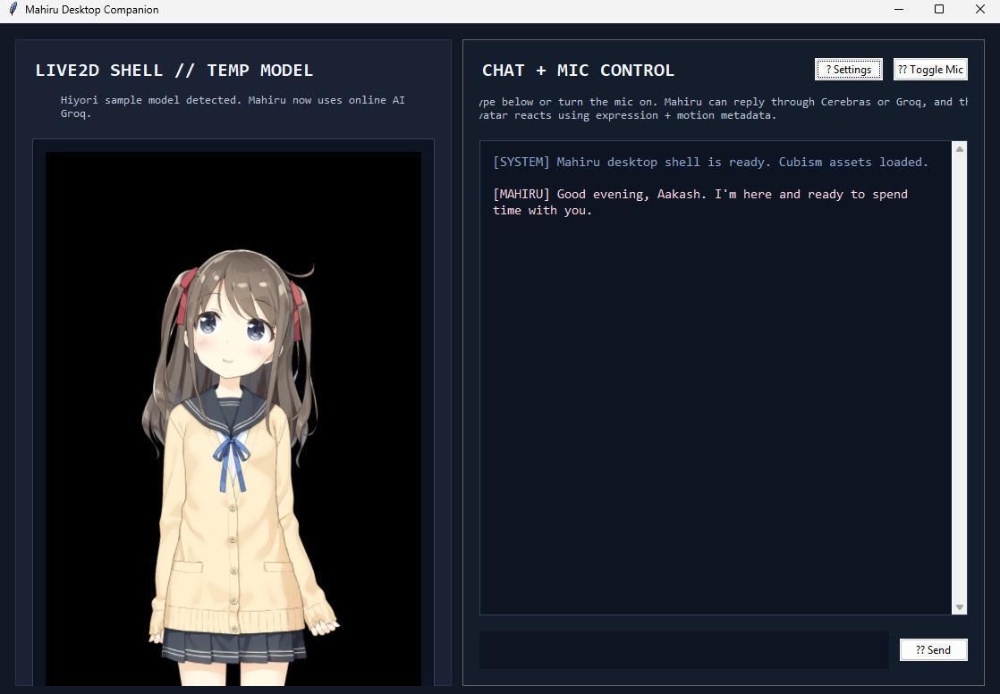
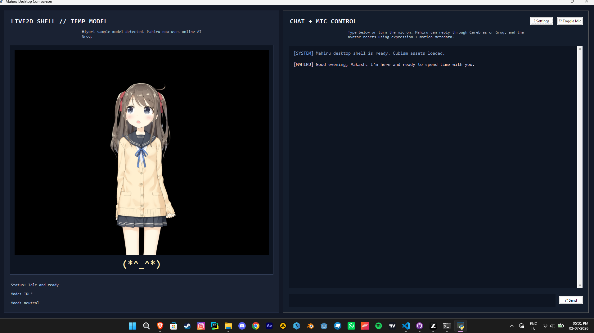
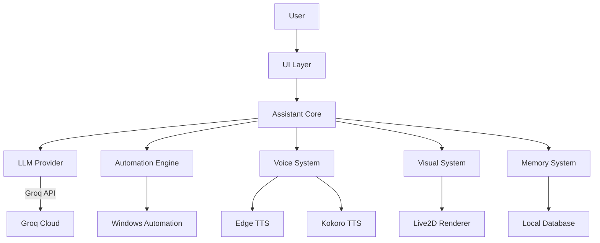

# 🌸 MahiruAI - Your Anime Desktop Companion

> A living, breathing AI anime character that talks, listens, and helps you with your computer.

[](https://python.org)
[](https://microsoft.com)
[](LICENSE)
[](https://github.com/AakashThunderz/MahiruAI)

MahiruAI transforms your desktop into a living anime world. Inspired by Mahiru Shiina from "The Angel Next Door Spoils Me Rotten", this isn't just another chatbot - it's your personal AI companion that:

- **Talks naturally** with expressive voice synthesis
- **Listens attentively** through advanced speech recognition
- **Controls your computer** with voice commands
- **Shows emotions** through a beautiful Live2D avatar
- **Remembers you** with personalized interactions
- **Helps with tasks** from opening apps to searching media

Think of it as Jarvis meets your favorite anime character - a true desktop companion that grows with you.

---

## 🌟 Vision: Beyond Chatbots

> "I want to create an AI that doesn't just respond to commands, but feels like a real companion living on your desktop."

MahiruAI aims to be:

🔹 **More than an assistant** - A character with personality and memory

🔹 **More than a chatbot** - A living presence on your desktop

The long-term dream:
- **True emotional responses** through advanced expression systems
- **Contextual awareness** of what you're doing on your computer
- **Natural conversations** that flow like talking to a friend
- **Visual interaction** with proper lip-sync and gestures
- **Personal growth** as the AI learns your preferences over time

This is just the beginning. We're building the foundation for something extraordinary.

---

## ✨ Current Features

### 🗣️ Core Interaction

✅ **Natural Conversations** - Chat with Mahiru about anything
✅ **Groq API Integration** - Fast, intelligent responses using Groq's LLM
✅ **Voice Input/Output** - Talk to Mahiru and hear her responses
✅ **Personality System** - Mahiru has her own character

### 🎤 Voice System

✅ **Edge TTS Integration** - High-quality online voice synthesis
✅ **Kokoro TTS Support** - Offline voice option
✅ **Speech Recognition** - Hands-free voice control
✅ **Voice Settings** - Adjust pitch, speed, and volume

### 🖥️ System Integration

✅ **Application Control** - Open/close apps with voice commands
✅ **File System Access** - Find and open files/folders
✅ **Window Management** - Control windows with voice
✅ **Media Search** - Find and play music/videos
✅ **Web Automation** - Search and browse the web
✅ **System Actions** - Volume control, screenshots, and more

### 👗 Visual System

✅ **Live2D Avatar** - Live2D integration framework
✅ **Live2D Framework** - Basic emotional responses
✅ **Customizable Appearance** - Adjust avatar position and scale

---

## 🚀 Planned Features

### 📅 Short-Term Roadmap

⬜ **Streaming Responses** - Real-time LLM output
⬜ **Enhanced Expressions** - More avatar emotions
⬜ **Lip Sync** - Avatar mouth movements matching speech
⬜ **Improved Memory** - Better context retention
⬜ **Plugin System** - Easy feature expansion
⬜ **Mahiru's Live2d** - I have to use the actual Model of Mahiru

### 🌌 Long-Term Vision

⬜ **Vision System** - "See" what's on your screen
⬜ **Emotion Engine** - Dynamic personality responses
⬜ **Local AI Models** - Offline operation capability
⬜ **Custom Mahiru Model** - Train your own version
⬜ **Desktop Awareness** - Understand your work context
⬜ **Multi-Character** - Different companion personalities
⬜ **VR Integration** - Step into Mahiru's world

---

## 📷 Screenshots

<details>


### 💻 Desktop Interface

<p align="center">
    
</p>
</details>

<p align="center">
    
</p>
---

## 🏗️ Architecture



### 📦 Module Breakdown

| Module | Responsibility | Technologies |
|--------|----------------|--------------|
| **UI Layer** | Chat interface, settings, avatar display | Tkinter, Live2D |
| **Assistant Core** | Command routing, personality, memory | Python |
| **LLM Provider** | Intelligence backend | Groq API |
| **Automation** | System control, app launching | PyAutoGUI, Selenium |
| **Voice System** | Speech synthesis and recognition | Edge TTS, Kokoro, SpeechRecognition |
| **Visual System** | Avatar rendering and animations | Live2D Cubism |
| **Memory** | User preferences and history | JSON Storage |

---

## 📁 Project Structure

```text
.
├── .env.example                  # Environment configuration template
├── main.py                       # Application entry point
├── requirements.txt             # Python dependencies
├── logs/                         # Application logs
├── utils/                        # Utility functions
│   └── helpers.py                # Common helpers
├── features/                     # Core functionality
│   ├── app_actions.py            # Application control
│   ├── file_actions.py           # File system operations
│   ├── media_actions.py          # Media search and playback
│   ├── pc_control.py             # System control functions
│   ├── resolver.py               # Command routing
│   ├── system_actions.py         # System-level actions
│   ├── web_actions.py            # Web browsing automation
│   ├── window_actions.py         # Window management
│   └── workflow_actions.py       # Workflow automation
├── mahiru/                      # Core AI systems
│   ├── assistant.py              # Main assistant logic
│   ├── brain.py                  # Response orchestration
│   ├── companion.py              # Personality and memory
│   ├── core.py                   # Core utilities
│   ├── listener.py               # Speech recognition
│   ├── online_providers.py       # Groq API integration
│   ├── online_settings.py        # Provider configuration
│   ├── personality.py            # Character personality
│   ├── response_types.py         # Response schemas
│   ├── tts_settings.py           # TTS configuration
│   ├── voice.py                  # Voice system core
│   ├── voice_worker.py           # TTS worker process
│   └── KokoroTTS/                # Kokoro TTS integration
│       └── kokorotts.py          # Kokoro implementation
└── visuals/                     # Visual components
    ├── avatar_state.py           # Avatar state management
    ├── live2d_frame.py           # Live2D rendering
    ├── model_loader.py           # Model loading
    ├── ui.py                     # Main UI components
    └── assets/                   # Visual assets
        └── models/               # Live2D models
```

---

## 🛠️ Installation

### 📋 Prerequisites

- Windows 10 or Windows 11
- Python 3.11 or newer recommended
- Microphone for voice input
- Brave Browser for browser automation features
- Internet connection for Cerebras, Groq, Edge TTS, and Google speech recognition
- Local Kokoro model file for offline Kokoro TTS

The project imports several desktop/runtime libraries. Install dependencies from `requirements.txt` first. If optional modules such as Live2D, OpenGL, or Selenium are missing in your environment, install the matching packages required by your local setup.

## 🚀 Installation Guide

1. Clone or download the repository.

```bash
git clone <repository-url>
cd ai_anime_assistant(mahiru-ai)
```

2. **Create virtual environment**
   ```bash
   python -m venv .venv
   .\.venv\Scripts\activate
   ```

3. **Install dependencies**
   ```bash
   pip install -r requirements.txt
   ```

4. Download `Kokoro_espeak_Q4.gguf` and place it inside:

```text
mahiru/KokoroTTS/
```

5. **Configure environment**
   - Copy `.env.example` to `.env`
   - Add your [Groq API key](https://console.groq.com/keys)

6. **Run MahiruAI**
   ```bash
   python main.py
   ```

> **Tip:** For best results, use a quality microphone and ensure your speakers are working properly.

---

## 🔑 Environment Variables

Create a `.env` file in the project root with these variables:

```ini
# Groq API Configuration
GROQ_API_KEY=your_groq_api_key_here
DEFAULT_GROQ_MODEL=llama-3.3-70b-versatile

# User Configuration
USER_NAME=YourName

# Voice Configuration
VOICE_ID=en-US-AriaNeural  # Edge TTS voice
RATE=0                     # Speech rate (-10 to 10)
PITCH=0                    # Speech pitch (-10 to 10)
VOLUME=100                 # Volume level (0-100)

# Kokoro TTS Configuration
KOKORO_MODEL_PATH=mahiru/KokoroTTS/Kokoro_espeak_Q4.gguf
KOKORO_VOICE=af_bella      # Kokoro voice preset
KOKORO_SPEED=1.0           # Speech speed (0.5-2.0)
```

> **Important:** Never commit your `.env` file to version control. It's listed in `.gitignore` for your protection.

---

## 💬 Usage Examples

### 🗣️ Basic Commands

```text
Open Discord
Close Spotify
Minimize Chrome
Maximize Visual Studio Code
Open Downloads folder
Search for free api keys provider
Play "Death Bed" from YouTube
Play "Sahiba" from Spotify
```

### 🤖 Assistant Commands

```text
Remind me to drink water in 20 minutes
What do you remember about me?
Switch to study mode
Take a screenshot
Volume up
Mute volume
```

## 🛠️ Troubleshooting

| Problem | What to Check |
| --- | --- |
| No assistant reply | Verify `CEREBRAS_API_KEY` and `GROQ_API_KEY` in `config.py`. |
| Cerebras fails | Check the selected Cerebras model and API quota, then use Groq fallback from settings. |
| Groq fails | Check the selected Groq model name and API key. |
| No voice output | Test both Edge TTS and Kokoro TTS from settings. |
| Kokoro is slow | Make sure `Kokoro_espeak_Q4.gguf` is inside `mahiru/KokoroTTS/` and the voice worker is running in service mode. |
| Microphone does not work | Check microphone permissions, PyAudio installation, and internet access for Google speech recognition. |
| Live2D model does not render | Check that Live2D, OpenGL, and `pyopengltk` are installed and that a valid `.model3.json` exists under `visuals/assets/models/`. |
| Browser opens but does not autoplay | Make sure Brave is installed at the expected Windows path and that Selenium can control the browser. Some websites block autoplay. |
| App command opens the wrong app | Delete the cached app index in `.cache/` and let the assistant rebuild it. |
| Import or syntax error | Run Python from the project root and check recently edited source files, especially schema files such as `mahiru/response_types.py`. |

## 🗺️ Roadmap

- Add a complete offline LLM provider implementation in `mahiru/offline_providers.py`.
- Add Ollama/local model routing while keeping only one model active at a time.
- Improve Live2D expression mapping and model-level lip sync.
- Harden browser autoplay for YouTube, Spotify, and other platforms.
- Add automated tests for command routing, media search, and provider fallback.
- Improve dependency packaging and document optional Live2D/Selenium dependencies clearly.
- Add Windows `.exe` packaging support.
- Move secrets to environment variables or a safer local configuration flow.
- Add a cleaner open-source license file if the project is intended for public reuse.

## 🙏 Credits

- Project author: Aakash / KairoqX
- Live2D Cubism ecosystem for avatar rendering support
- Kokoro TTS for local voice generation
- Edge TTS for online voice generation
- Cerebras and Groq for online LLM inference
- Python open-source libraries used throughout the project

## 📄 License

Copyright (c) 2026 Aakash (KairoqX).

All rights reserved unless a separate license file is added to this repository.
