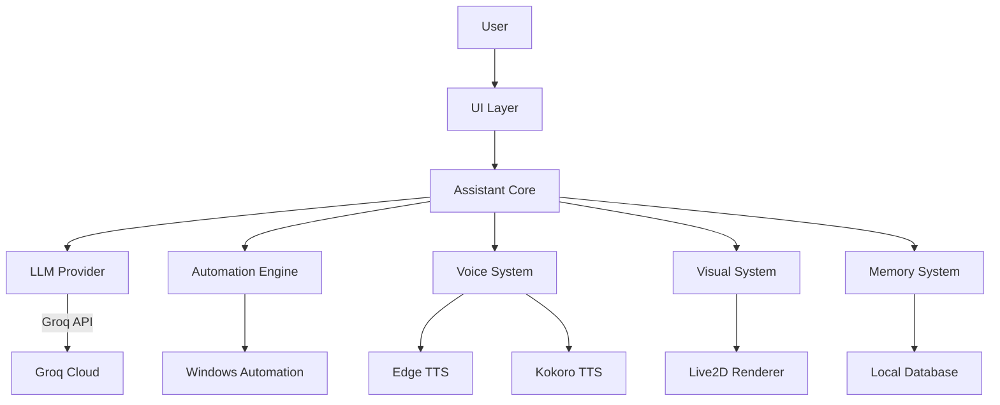

# 🌸 MahiruAI - Your Anime Desktop Companion

> A living, breathing AI anime character that talks, listens, and helps you with your computer.

[](https://python.org)
[](https://microsoft.com)
[](LICENSE)
[](https://github.com/AakashThunderz/MahiruAI)

MahiruAI transforms your desktop into a living anime world. Inspired by Mahiru Shiina from "The Angel Next Door Spoils Me Rotten", this isn't just another chatbot - it's your personal AI companion that:

- **Talks naturally** with expressive voice synthesis
- **Listens attentively** through advanced speech recognition
- **Controls your computer** with voice commands
- **Shows emotions** through a beautiful Live2D avatar
- **Remembers you** with personalized interactions
- **Helps with tasks** from opening apps to searching media

Think of it as Jarvis meets your favorite anime character - a true desktop companion that grows with you.

---

## 🌟 Vision: Beyond Chatbots

> "I want to create an AI that doesn't just respond to commands, but feels like a real companion living on your desktop."

MahiruAI aims to be:

🔹 **More than an assistant** - A character with personality and memory

🔹 **More than a chatbot** - A living presence on your desktop

The long-term dream:
- **True emotional responses** through advanced expression systems
- **Contextual awareness** of what you're doing on your computer
- **Natural conversations** that flow like talking to a friend
- **Visual interaction** with proper lip-sync and gestures
- **Personal growth** as the AI learns your preferences over time

This is just the beginning. We're building the foundation for something extraordinary.

---

## ✨ Current Features

### 🗣️ Core Interaction

✅ **Natural Conversations** - Chat with Mahiru about anything
✅ **Groq API Integration** - Fast, intelligent responses using Groq's LLM
✅ **Voice Input/Output** - Talk to Mahiru and hear her responses
✅ **Personality System** - Mahiru has her own character

### 🎤 Voice System

✅ **Edge TTS Integration** - High-quality online voice synthesis
✅ **Kokoro TTS Support** - Offline voice option
✅ **Speech Recognition** - Hands-free voice control
✅ **Voice Settings** - Adjust pitch, speed, and volume

### 🖥️ System Integration

✅ **Application Control** - Open/close apps with voice commands
✅ **File System Access** - Find and open files/folders
✅ **Window Management** - Control windows with voice
✅ **Media Search** - Find and play music/videos
✅ **Web Automation** - Search and browse the web
✅ **System Actions** - Volume control, screenshots, and more

### 👗 Visual System

✅ **Live2D Avatar** - Live2D integration framework
✅ **Live2D Framework** - Basic emotional responses
✅ **Customizable Appearance** - Adjust avatar position and scale

---

## 🚀 Planned Features

### 📅 Short-Term Roadmap

⬜ **Streaming Responses** - Real-time LLM output
⬜ **Enhanced Expressions** - More avatar emotions
⬜ **Lip Sync** - Avatar mouth movements matching speech
⬜ **Improved Memory** - Better context retention
⬜ **Plugin System** - Easy feature expansion
⬜ **Mahiru's Live2d** - I have to use the actual Model of Mahiru

### 🌌 Long-Term Vision

⬜ **Vision System** - "See" what's on your screen
⬜ **Emotion Engine** - Dynamic personality responses
⬜ **Local AI Models** - Offline operation capability
⬜ **Custom Mahiru Model** - Train your own version
⬜ **Desktop Awareness** - Understand your work context
⬜ **Multi-Character** - Different companion personalities
⬜ **VR Integration** - Step into Mahiru's world

---

## 📷 Screenshots

<details>


### 💻 Desktop Interface

<p align="center">
    
</p>
</details>

<p align="center">
    
</p>
---

## 🏗️ Architecture



### 📦 Module Breakdown

| Module | Responsibility | Technologies |
|--------|----------------|--------------|
| **UI Layer** | Chat interface, settings, avatar display | Tkinter, Live2D |
| **Assistant Core** | Command routing, personality, memory | Python |
| **LLM Provider** | Intelligence backend | Groq API |
| **Automation** | System control, app launching | PyAutoGUI, Selenium |
| **Voice System** | Speech synthesis and recognition | Edge TTS, Kokoro, SpeechRecognition |
| **Visual System** | Avatar rendering and animations | Live2D Cubism |
| **Memory** | User preferences and history | JSON Storage |

---

## 📁 Project Structure

```text
.
├── .env.example                  # Environment configuration template
├── main.py                       # Application entry point
├── requirements.txt             # Python dependencies
├── logs/                         # Application logs
├── utils/                        # Utility functions
│   └── helpers.py                # Common helpers
├── features/                     # Core functionality
│   ├── app_actions.py            # Application control
│   ├── file_actions.py           # File system operations
│   ├── media_actions.py          # Media search and playback
│   ├── pc_control.py             # System control functions
│   ├── resolver.py               # Command routing
│   ├── system_actions.py         # System-level actions
│   ├── web_actions.py            # Web browsing automation
│   ├── window_actions.py         # Window management
│   └── workflow_actions.py       # Workflow automation
├── mahiru/                      # Core AI systems
│   ├── assistant.py              # Main assistant logic
│   ├── brain.py                  # Response orchestration
│   ├── companion.py              # Personality and memory
│   ├── core.py                   # Core utilities
│   ├── listener.py               # Speech recognition
│   ├── online_providers.py       # Groq API integration
│   ├── online_settings.py        # Provider configuration
│   ├── personality.py            # Character personality
│   ├── response_types.py         # Response schemas
│   ├── tts_settings.py           # TTS configuration
│   ├── voice.py                  # Voice system core
│   ├── voice_worker.py           # TTS worker process
│   └── KokoroTTS/                # Kokoro TTS integration
│       └── kokorotts.py          # Kokoro implementation
└── visuals/                     # Visual components
    ├── avatar_state.py           # Avatar state management
    ├── live2d_frame.py           # Live2D rendering
    ├── model_loader.py           # Model loading
    ├── ui.py                     # Main UI components
    └── assets/                   # Visual assets
        └── models/               # Live2D models
```

---

## 🛠️ Installation

### 📋 Prerequisites

- Windows 10/11
- Python 3.11+
- Microphone (for voice input)
- Brave Browser (for web automation)
- Internet connection (for Groq and Edge TTS)

### 🔧 Setup Steps

1. **Clone the repository**
   ```bash
   git clone https://github.com/AakashThunderz/MahiruAI.git
   cd MahiruAI
   ```

2. **Create virtual environment**
   ```bash
   python -m venv .venv
   .\.venv\Scripts\activate
   ```

3. **Install dependencies**
   ```bash
   pip install -r requirements.txt
   ```

4. **Download Kokoro model**
   - Get `Kokoro_espeak_Q4.gguf` from [Kokoro TTS](https://huggingface.co/mmwillet2/Kokoro_GGUF/resolve/main/Kokoro_espeak_Q4.gguf?download=true)
   - Place it in `mahiru/KokoroTTS/`

5. **Configure environment**
   - Copy `.env.example` to `.env`
   - Add your [Groq API key](https://console.groq.com/keys)

6. **Run MahiruAI**
   ```bash
   python main.py
   ```

> **Tip:** For best results, use a quality microphone and ensure your speakers are working properly.

---

## 🔑 Environment Variables

Create a `.env` file in the project root with these variables:

```ini
# Groq API Configuration
GROQ_API_KEY=your_groq_api_key_here
DEFAULT_GROQ_MODEL=llama-3.3-70b-versatile

# User Configuration
USER_NAME=YourName

# Voice Configuration
VOICE_ID=en-US-AriaNeural  # Edge TTS voice
RATE=0                     # Speech rate (-10 to 10)
PITCH=0                    # Speech pitch (-10 to 10)
VOLUME=100                 # Volume level (0-100)

# Kokoro TTS Configuration
KOKORO_MODEL_PATH=mahiru/KokoroTTS/Kokoro_espeak_Q4.gguf
KOKORO_VOICE=af_bella      # Kokoro voice preset
KOKORO_SPEED=1.0           # Speech speed (0.5-2.0)
```

> **Important:** Never commit your `.env` file to version control. It's listed in `.gitignore` for your protection.

---

## 💬 Usage Examples

### 🗣️ Basic Commands

```text
Open Discord
Close Spotify
Minimize Chrome
Maximize Visual Studio Code
Open Downloads folder
Search for free api keys provider
Play "Death Bed" from YouTube
Play "Sahiba" from Spotify
```

### 🤖 Assistant Commands

```text
Remind me to drink water in 20 minutes
What do you remember about me?
Switch to study mode
Take a screenshot
Volume up
Mute volume
What's the weather today?
```

### 💬 Conversation Examples

```text
User: Good morning Mahiru!
Mahiru: *cheerful* Good morning! Did you sleep well? I made sure to
        keep everything ready for your day!

User: I feel a bit tired today...
Mahiru: *concerned* Oh no! Maybe you should take a short break?
        Would you like me to play some relaxing music?

User: Tell me a joke
Mahiru: *playful* Why don't scientists trust atoms?
        Because they make up everything! *giggles*
```

---

## 💻 Technologies

| Category | Technology | Purpose |
|----------|------------|---------|
| **Language** | Python 3.11 | Core application |
| **AI Backend** | Groq API | Intelligence engine |
| **Voice (Online)** | Edge TTS | High-quality speech |
| **Voice (Offline)** | Kokoro TTS | High=quality offline voice |
| **Speech Recognition** | SpeechRecognition | Voice input |
| **UI Framework** | Tkinter | Desktop interface |
| **Avatar System** | Live2D Cubism | Character rendering |
| **Browser Automation** | Selenium | Web interactions |
| **System Control** | PyAutoGUI | Desktop automation |
| **Audio Processing** | PyAudio | Audio handling |
| **Configuration** | python-dotenv | Environment management |

---

## 🗺️ Development Roadmap

### 📅 Version Plan

| Version | Focus | Key Features |
|---------|-------|--------------|
| **v0.1** | Core Foundation | Basic chat, voice I/O, simple automation |
| **v0.2** | Personality Layer | Memory system, basic emotions, improved responses |
| **v0.3** | Visual Enhancements | Better Live2D integration, expressions, lip sync |
| **v0.4** | System Integration | Deep Windows control, app management, workflows |
| **v0.5** | Plugin System | Extensible architecture, community contributions |
| **v0.6** | Performance | Optimization, stability, bug fixes |
| **v1.0** | Polished Experience | Complete feature set, documentation, installer |

### 🎯 Current Focus (v0.1)

- [x] Basic chat interface
- [x] Groq API integration
- [x] Voice input/output
- [x] Simple system commands
- [x] Live2D avatar display
- [ ] Streaming responses
- [ ] Basic expressions
- [ ] Memory system
- [ ] Plugin architecture

---

## 🌌 Future Vision

MahiruAI is just getting started. Future versions will include:

🔮 **True Companion AI** - Not just responses, but real interaction
👁️ **Visual Awareness** - Understanding what's on your screen
🧠 **Advanced Memory** - Remembering your preferences and history
🎭 **Dynamic Personality** - Moods that change based on interaction
🎤 **Natural Voice** - Perfect intonation and emotion
🖥️ **Deep Integration** - Understanding your workflow
🌐 **Cross-Platform** - Beyond just Windows
🤖 **Local AI Option** - For privacy-focused users
🎨 **Customization** - Make Mahiru truly yours

> "The goal isn't just to build an AI assistant - it's to create a companion that feels alive on your desktop."

---

## 🤝 Contributing

We welcome contributions from the community! Here's how you can help:

### 🐞 Bug Reports

Found a bug? [Open an issue](https://github.com/AakashThunderz/MahiruAI/issues) with:
- Clear description
- Steps to reproduce
- Expected vs actual behavior
- Screenshots if possible

### 💡 Feature Requests

Have an idea? [Submit a feature request](https://github.com/AakashThunderz/MahiruAI/issues) with:
- Detailed description
- Use cases
- Mockups if applicable

### 🛠️ Code Contributions

1. Fork the repository
2. Create a feature branch (`git checkout -b feature/your-feature`)
3. Commit your changes (`git commit -am 'Add some feature'`)
4. Push to the branch (`git push origin feature/your-feature`)
5. Open a Pull Request(`https://github.com/AakashThunderz/MahiruAI/pulls`)


## 🙏 Credits

### 👤 Core Team

- **Aakash (KairoqX)** - Creator and Lead Developer

### 🤝 Open Source Projects

MahiruAI stands on the shoulders of these amazing projects:
- [Groq](https://groq.com/) - Fast LLM inference
- [Edge TTS](https://github.com/ranaroussi/edge-tts) - Speech synthesis
- [Kokoro TTS](https://huggingface.co/) - Japanese voice
- [Live2D Cubism](https://www.live2d.com/) - Avatar rendering
- [SpeechRecognition](https://github.com/Uberi/speech_recognition) - Voice input
- [Selenium](https://www.selenium.dev/) - Browser automation

### 🎨 Asset Credits

- Live2D models used with permission from their creators

---

## 📜 License

© 2026 Aakash (KairoqX). All Rights Reserved.

> **Important:** This project is currently closed-source. The code is provided for personal use and study only. Redistribution, commercial use, or derivative works are not permitted without explicit permission.

For inquiries about licensing or collaboration, please contact:
📧 [kairoqxae1@gmail.com](mailto:kairoqxae1@gmail.com)

---

## 📬 Contact

Have questions or want to collaborate? Reach out:

📧 Email: [kairoqxae1@gmail.com](mailto:kairoqxae1@gmail.com)
💬 Discord: KairoqX
✖️ X: [@KairoqX](https://x.com/@kairoqx)


---

## ⚠️ Important Notes

<details>
<summary>🔍 Click to view important information</summary>

### 🛑 Current Limitations

- **Windows Only** - Currently optimized for Windows 10/11
- **Experimental** - Expect bugs and missing features
- **Resource Intensive** - Live2D and voice processing require decent hardware
- **Internet Required** - For Groq API and Edge TTS (Kokoro works offline)

### 🔒 Privacy Considerations

- Voice input is processed locally (except Google speech recognition)
- Chat history is stored locally only
- No data is sent to any servers except:
  - Groq API (for intelligence)
  - Edge TTS (for speech synthesis)
  - Google (for speech recognition if enabled)

### 📥 Data Storage

The application stores:
- `.env` - Your configuration (never committed)
- `.cache/` - Temporary files and indexes
- `logs/` - Application logs
- Local database - Conversation history and memory

### 🛠️ Troubleshooting

| Issue | Solution |
|-------|----------|
| No response from Mahiru | Check Groq API key and internet connection |
| Voice not working | Verify microphone permissions and TTS settings |
| Live2D not displaying | Ensure OpenGL drivers are up to date |
| Commands not working | Check application paths in settings |
| Slow performance | Try reducing Live2D model quality |

</details>

---

> **"MahiruAI is more than code - it's about bringing characters to life on your desktop."**

[](https://github.com/AakashThunderz/MahiruAI/stargazers)
[](https://github.com/AakashThunderz/MahiruAI/network/members)

*Built with ❤️ for anime fans and AI enthusiasts worldwide*
